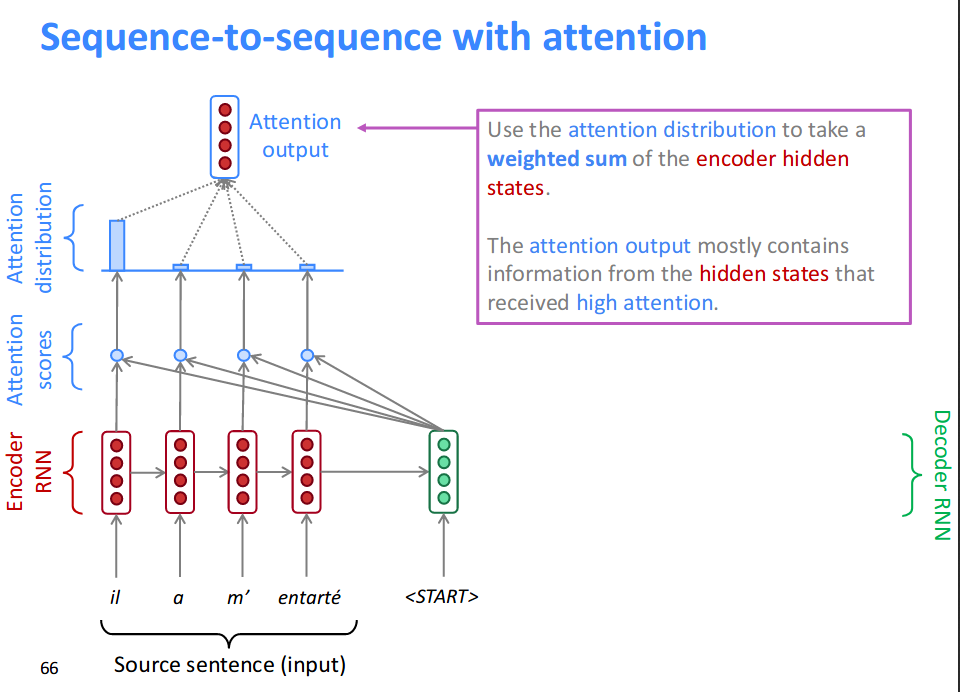
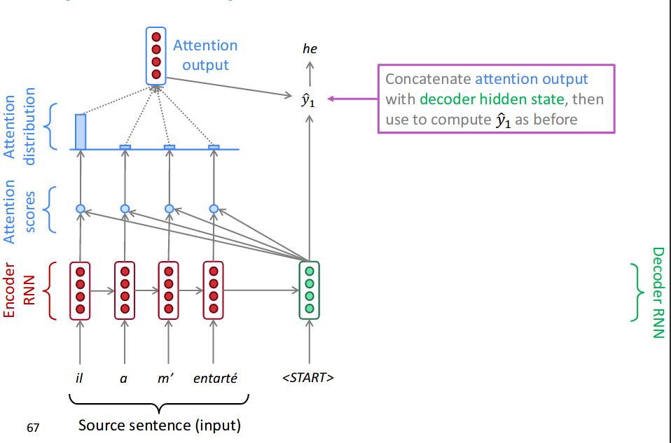
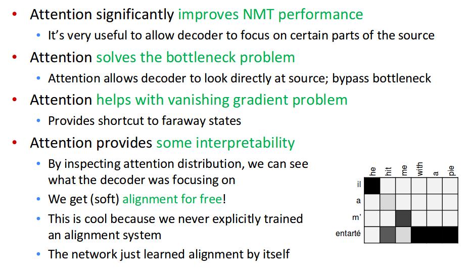

### Translation, Seq2Seq, Attention

**1. statistical machine translation**

=argmax_yP(x|y)P(y))

**2. Neural machine translation**

The seq2seq model

很多NLP的任务都用到了seq2seq
- summarization
- dialogue
- parsing
- code generation

seq2seq是conditional language model的一种例子。
- language model在于decoder是来预测下一个单词
- conditional在于它的预测是以source sentence x为condition的

NMT直接计算P(y|x):

=P(y_1|x)P(y_2|y_1,x)P(y_3|y_2,y_1,x))

#####如何训练？

准备大量平行预料，将source和target sentence送入encoder RNN 和 decoder RNN。

有个学生提问，是否可以先分别训练encoder和decoder，之后再一起训练。

确实有一些人训练decoder为一个比较强的language model，之后用它来初始化decoder。

这里的word embedding和language model类似，有多种选择。

**3.greedy decoding**

选择概率最高的单词。

缺点：
- 当前时刻概率最高的单词，不一定是整句话概率最高的单词。

如何解决这个问题？

     beam search decoding

在decoder的每个时间步，跟踪k个最可能的翻译(hypotheses)

- k是beam size，通常5-10
- beam search并不能保证找到最优解，exhaust search可以，但是代价太高。

stop criterion

greedy decoding，通常是等到model产生一个<END> token。
beam search decoding，每个hypothesis产生end token的位置不同，事先定义一个时间t，到达这个时间停止，或者完成n个完整的hypothesis。

那如何选择最终的句子呢？
直接选择的问题是，越长的句子得到的概率越低。
所以加入了正则化，考虑句子长度。

)

为什么不在beam search的时候就用上面这个式子呢？是因为beam search的时候，句子长度都一样。

与SMT相比，NMT的优点：
- better performance
-- more fluent
-- better use of context
-- better use of phrase similarities
- end to end
- 不需要很多的human engineering effor
--没有特征工程
--所有的语言可以用相似的方法。

缺点：
- 不容易理解
--hard to debug
- 难以控制

----
如何评估？
BLUE(Bilingual Evaluation Understudy)
和一个或者多个人工翻译的进行比较，计算相似度

- n-gram percision(1-4)
- 添加short的惩罚项。

BLUE is useful but imperfect
- 有很多方法来翻译一句话
- 一个好的翻译也可能得到低的BLEU值

目前NMT存在的一些问题：
- out-of-vocabulary words
- domain mismatch between train and test data
- maintaining context overt longer text
- low-resource language pairs
- 没有common sense
- 容易根据training data产生bias

目前NMT中最常用的改进就是attention了。

Sometimes we take the attention output from the previous step, and also feed it into the decoder (along with the usual decoder input).

attention有很多优点

attention可以用在很多非seq2seq，或者其他任务上。

attention有很多类型：
- Basic dot-product attention
- Multiplicative attention
- Additive attention